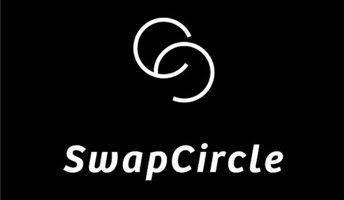
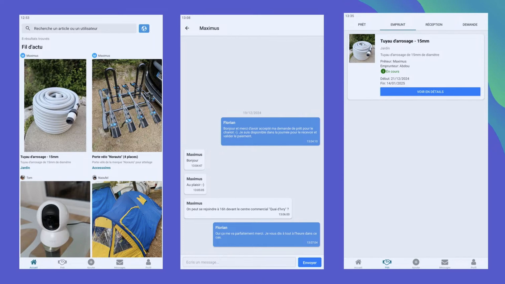

# Swap Circle (Partie Backend)

<p align="center">
  
</p>

Swap Circle est une application React Native/Expo permettant le prêt d'objets entre voisins, amis ou autres, avec un système de caution assurant la protection légale des échanges.

Ce dépôt contient le backend NestJS de l'application. Il expose l'API utilisée par l'application mobile pour gérer les utilisateurs, les objets, les demandes de prêt, les cautions, la messagerie, les notifications push et les fichiers associés aux annonces.



## Fonctionnalités principales

- Gestion des comptes, authentification JWT et rôles.
- Publication et consultation d'objets disponibles au prêt.
- Demandes de prêt, suivi des emprunts et réceptions.
- Caution et paiements via Stripe.
- Conversations et messages entre utilisateurs.
- Upload de fichiers vers S3 et diffusion via CloudFront.
- Notifications push Expo.

## Prérequis

- Node.js 20 ou version compatible avec NestJS 10.
- npm.
- Une base de données MySQL.
- Des clés AWS S3/CloudFront si l'upload de fichiers est utilisé.
- Une clé secrète Stripe si le module de caution/paiement est utilisé.

## Installation

Installe les dépendances du backend :

```bash
npm install
```

Crée ensuite le fichier d'environnement local :

```bash
cp .env.example .env
```

Renseigne les variables nécessaires dans `.env` :

```env
DB_HOST=localhost
DB_USER=root
DB_PASSWORD=password
DB_NAME=swap_circle
DB_PORT=3306

AWS_ACCESS_KEY=...
AWS_SECRET_KEY=...
BUCKET_NAME=...
BUCKET_ITEM_PICTURES_DIRECTORY_NAME=...
BUCKET_PFP_DIRECTORY_NAME=...
URL_CLOUDFRONT=...
YOUR_STRIPE_SECRET_KEY=...

JWT_SECRET_KEY=...
```

## Lancer l'application

Lance le backend en mode développement :

```bash
npm run start:dev
```

L'API démarre sur :

```text
http://localhost:3000
```

La documentation Swagger est disponible sur :

```text
http://localhost:3000/gpe
```

Pour lancer l'application en mode production :

```bash
npm run build
npm run start:prod
```

## Structure du projet

```text
src/
  auth/                 Authentification et autorisation
  file/                 Upload et gestion des fichiers
  friend/               Relations entre utilisateurs
  item/                 Objets disponibles au prêt
  loan/                 Prêts et emprunts
  loan-request/         Demandes de prêt
  message/              Messages
  payment/              Paiements et cautions
  push-notification/    Notifications push Expo
  thread/               Conversations
  user/                 Utilisateurs
```

## Licence

Ce projet est distribué sous licence GPL-3.0. Consulte le fichier [LICENSE](LICENSE) pour plus d'informations.
